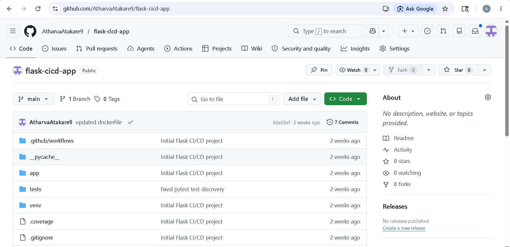
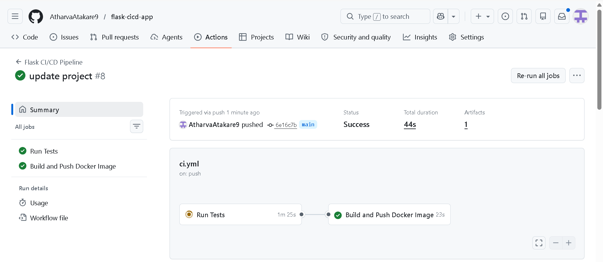
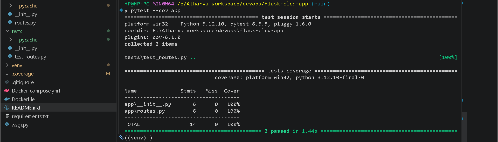
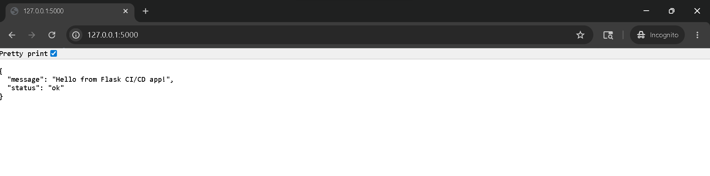
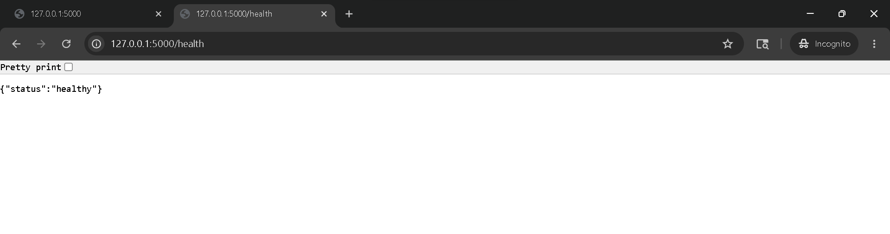
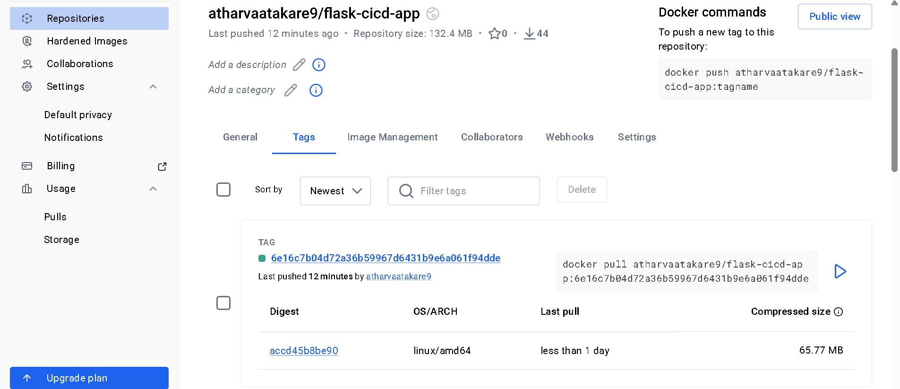

# 🚀 Flask CI/CD Pipeline Project

A production-style Flask application with complete CI/CD pipeline using **GitHub Actions + Docker + Docker Hub**.

---

# 📌 Project Overview

This project demonstrates a full DevOps workflow:

* Flask REST API
* Automated testing using Pytest
* Docker containerization
* CI/CD using GitHub Actions
* Docker Hub image publishing
* Automated build and deployment pipeline

---

# 🏗️ Architecture

```text
Developer → GitHub → GitHub Actions → Tests → Docker Build → Docker Hub
```

---

# 📂 Project Structure

```text
flask-cicd-app/
│
├── app/
│   ├── __init__.py
│   └── routes.py
│
├── tests/
│   └── test_routes.py
│
├── .github/
│   └── workflows/
│       └── ci.yml
│
├── Dockerfile
├── requirements.txt
├── wsgi.py
├── README.md
└── Screenshots/
```

---

# ⚙️ Features

* Flask API with health check
* Unit testing with Pytest
* Dockerized application
* CI/CD pipeline automation
* Docker Hub integration
* Automated image publishing

---

# 🌐 API Endpoints

## Home Endpoint

```http
GET /
```

### Response

```json
{
  "message": "Hello from Flask CI/CD app!",
  "status": "ok"
}
```

---

## Health Endpoint

```http
GET /health
```

### Response

```json
{
  "status": "healthy"
}
```

---

# ▶️ How to Run Project Locally

## 1. Clone Repository

```bash
git clone https://github.com/YOUR_USERNAME/flask-cicd-app.git
cd flask-cicd-app
```

---

## 2. Create Virtual Environment

### Windows

```bash
py -m venv venv
venv\Scripts\activate
```

### Linux / macOS

```bash
python3 -m venv venv
source venv/bin/activate
```

---

## 3. Install Dependencies

```bash
pip install -r requirements.txt
```

---

## 4. Run Application

```bash
python -m flask --app wsgi:app run
```

Open:

```text
http://127.0.0.1:5000
```

---

## 5. Run Tests

```bash
pytest --cov=app
```

---

# 🐳 Docker Setup

## Build Docker Image

```bash
docker build -t flask-cicd-app .
```

## Run Docker Container

```bash
docker run -d -p 5000:5000 flask-cicd-app
```

---

# 🔄 CI/CD Pipeline

Every push to the `main` branch automatically triggers:

1. Checkout Source Code
2. Install Dependencies
3. Run Unit Tests
4. Build Docker Image
5. Login to Docker Hub
6. Push Docker Image
7. Publish Build Status

---

# 📸 Screenshots

## 1️⃣ GitHub Repository

Repository structure and project files.



---

## 2️⃣ GitHub Actions Workflow

Successful workflow execution.



---

## 3️⃣ Pytest Execution

Test cases executed successfully.



---

## 4️⃣ Flask Application Running

Application running in browser.



---

## 5️⃣ Health Endpoint

Health endpoint response.



---

## 6️⃣ Docker Hub Repository

Docker image successfully pushed.



---

# 📂 Screenshot Folder Structure

```text
Screenshots/
├── github-repo.png
├── github-actions.png
├── pytest.png
├── flask-home.png
├── health.png
└── dockerhub.png
```

---

# 🧹 Cleanup Commands

## Stop Running Container

```bash
docker stop <container_id>
docker rm <container_id>
```

## Remove Docker Image

```bash
docker rmi <image_id>
```

## Remove Virtual Environment

### Linux/macOS

```bash
rm -rf venv
```

### Windows

```cmd
rmdir /s /q venv
```

---

# 💡 Key Learnings

* Flask Application Development
* Docker Containerization
* GitHub Actions CI/CD
* Automated Testing with Pytest
* Docker Hub Integration
* DevOps Pipeline Automation

---

